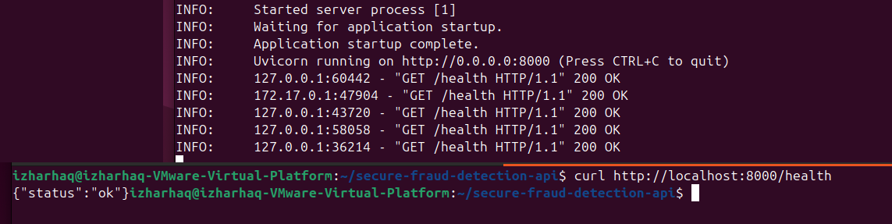
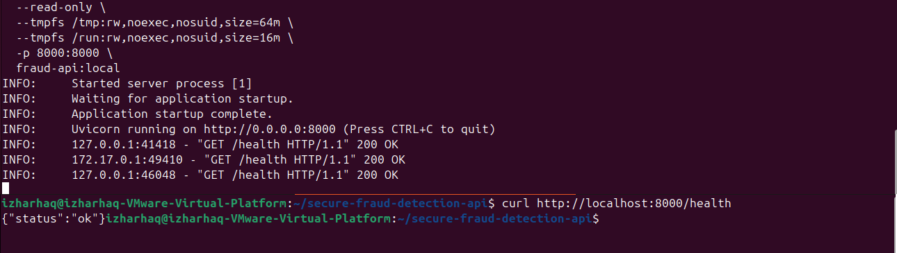
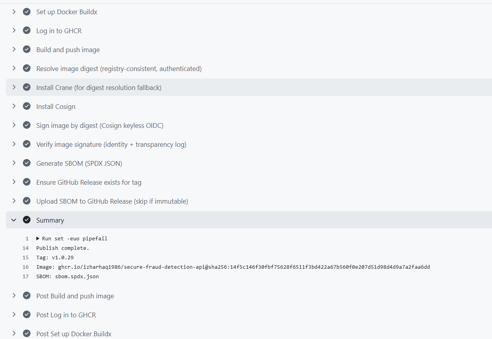
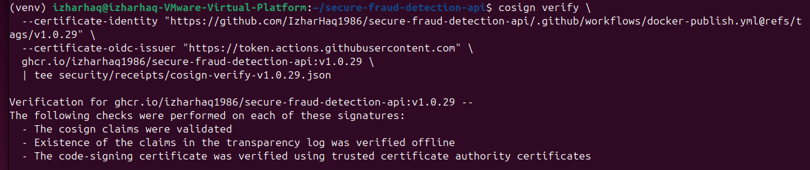
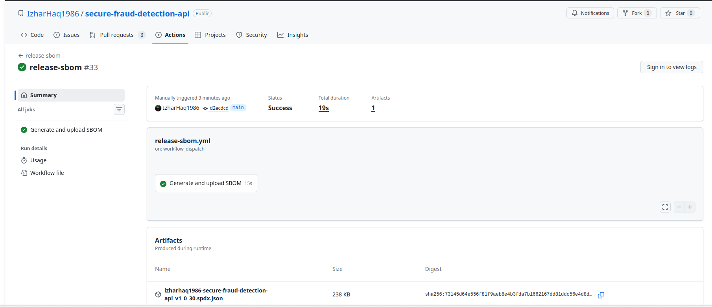

\

<!-- Tech Stack Badges -->


# Secure Fraud Detection API

FastAPI-based fraud detection service packaged as a signed and verifiable container image.

Python 3.11 · FastAPI · Docker (Distroless) · GHCR · Cosign (OIDC) · SPDX SBOM · MIT License.
```

## What This Repository Demonstrates

Secure API design for model inference
Audit-ready decision logging with trace IDs and model versioning
Threat modeling and risk-driven mitigation
Hardened container deployment with TLS-ready defaults
Signed container images with digest-based verification
Immutable releases with attached SBOM
This is structured as a client-facing sample. It is not a tutorial repo.
```

## I. Project Structure
```
secure-fraud-detection-api/
├── app/
│   ├── __init__.py
│   ├── main.py                # FastAPI app factory + router registration
│   ├── auth.py                # API-key authentication dependency
│   ├── schemas.py             # Pydantic request/response models
│   ├── middleware.py          # Security / rate limiting / request-id
│   ├── audit_logger.py        # Tamper-evident audit logging
│   ├── model_loader.py        # Model artifact loading & validation
│   └── routes/
│       └── predict.py         # /v1/predict endpoint
│
├── tests/
│   ├── conftest.py
│   ├── test_predict.py
│   └── test_routes_unique.py
│
├── scripts/
│   └── check_requirements_lock.sh
│
├── .github/
│   ├── workflows/
│   │   ├── docker-smoke.yml
│   │   ├── docker-smoke-readonly.yml
│   │   ├── docker-perf-sanity.yml
│   │   ├── docker-publish.yml
│   │   ├── verify-signature.yml
│   │   └── release-sbom.yml
│   └── dependabot.yml
│
├── requirements.txt
├── requirements.lock.txt
├── Dockerfile
└── README.md
```

## II. Getting Started
```
Run Locally
python -m venv venv
source venv/bin/activate
pip install -r requirements.txt
uvicorn app.main:app --reload

Open:
http://localhost:8000/health
Expected:
{"status":"ok"}
Run with Docker
docker build -t fraud-api:local .
docker run -p 8000:8000 fraud-api:local
```

## III. Container Image (GHCR)
```
Pull a tagged release:
docker pull ghcr.io/izharhaq1986/secure-fraud-detection-api:v1.0.X
Pull by digest for immutability:
docker pull ghcr.io/izharhaq1986/secure-fraud-detection-api@sha256:<digest>
```

## IV. Release Process (Tags + SBOM)
```
This repository uses semantic version tags.
Each Git tag:
Publishes a container image to GHCR
Signs the image using Cosign (OIDC)
Verifies the signature in CI
Generates an SPDX JSON SBOM
Attaches the SBOM to the GitHub Release
Immutable release behavior is handled safely.
If asset uploads are rejected due to immutability, CI skips without failing.
```
## V. Supply Chain Verification
```
Resolve image digest:
crane digest ghcr.io/izharhaq1986/secure-fraud-detection-api:vX.Y.Z
Verify signature:
cosign verify \
  --certificate-identity "https://github.com/IzharHaq1986/secure-fraud-detection-api/.github/workflows/docker-publish.yml@refs/tags/vX.Y.Z" \
  --certificate-oidc-issuer "https://token.actions.githubusercontent.com" \
  ghcr.io/izharhaq1986/secure-fraud-detection-api@sha256:<digest>

Inspect SBOM:
syft ghcr.io/izharhaq1986/secure-fraud-detection-api:vX.Y.Z
```

## VI. Screenshots
```
Stored in the docs/ directory.
Docker smoke test
Read-only filesystem validation
GHCR publish workflow
Cosign verification output
SBOM generation and release page

Example reference:
The following screenshots demonstrate the secure container supply-chain workflow implemented in this project.
```
### Docker Smoke Test

Container starts successfully and exposes the `/health` endpoint.



---

### Read-Only Container Execution

The container runs with a read-only filesystem, demonstrating runtime hardening.



---

### GHCR Publish Workflow

Container image successfully published to GitHub Container Registry.



---

### Cosign Signature Verification

Image signature verified using Cosign and GitHub OIDC identity.



---

### SBOM Generation

Software Bill of Materials generated using **Syft** and stored as a CI workflow artifact.


```

### VII. CI Enforcement
```
Required workflows:
docker-smoke
docker-smoke-readonly
docker-perf-sanity
docker-publish
verify-signature
release-sbom
Branch protection enforces required status checks.
```
### VIII. Skills Demonstrated
```
Secure FastAPI architecture
Hardened Docker builds (Distroless, non-root)
Digest-based signing
Cosign keyless OIDC flow
SBOM generation (SPDX)
Immutable release handling
Deterministic CI pipelines
OCI naming compliance
```
### IX. License
```
MIT License.
See the LICENSE file for details.
Project Status
Build pipeline: stable
Release flow: verified
Signing: enforced
SBOM: generated
OCI compliance: validated
```
